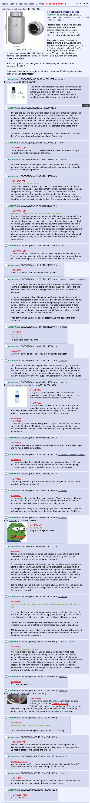

# temperature display for pressure cooker

I assembled and tested the pressure cooker I proposed below. I was unhappy with the weighted pressure control valve as it was heavy and it can clog. Temperature control is better. So I removed the weighted valve and used the spring loaded valve. Temperature is measured by DS18B20 inside a thermocouple tube attached to the lid using a cable gland. I will manually adjust the stove gas according to the temperatures displayed on a ssd1306 oled.

## Bill of Material

 - titanium bottle
 - esp32c3 dev board
 - 128x32 OLED using SSD1306
 - DS18B20
 - thermocouple tube
 - cable gland
 - step drill bits, drill
 - vibration motor
 - power bank

# TODO

 - [ ] dissatisfaction with dynamic graph limits
 - [ ] solder ds18b20, longer wires again
 - [ ] battery and housing and power switch
 - [ ] screen mounting such that it covers the dev board
 - [ ] vibration motor gets stuck with a 200 ms pulse. So the pulse needs to be longer, or connect it between two gpios to toggle reverse, or somehow use that configuration to measure whether it is moving

## TODO never

 - [ ] bluetooth/http app
    - [ ] display instructions (hotter colder)
    - [ ] display status
    - [ ] set buzzer parameters levels to activate
    - [ ] cooking time calculator
 - [ ] stepper motor to turn gas valve -- more likely project is temperature control the home stovetop mlx90614 because 1. pressure cooker stove adjustment will be infrequent compared with deep frying 2. motor is extra weight and complication, 3. the system has a high time constant (minutes because titanium has low conductivity) so closed loop PID will be much worse than the manual one (sort of model predictive control?)
